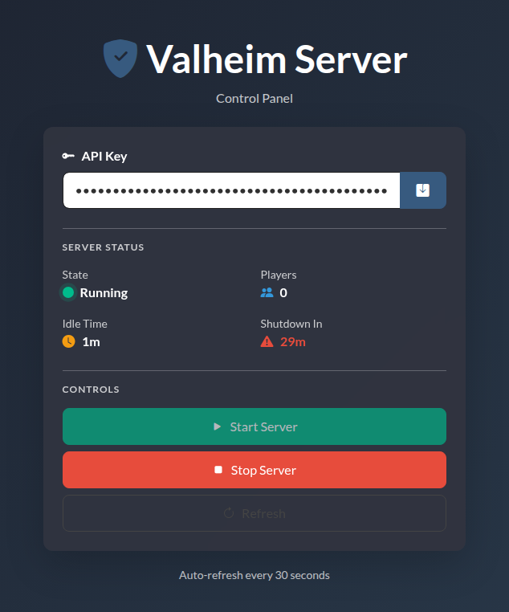

# Valheim Server Controller



A self-hosted Valheim dedicated server with automatic idle shutdown and a web interface to start, stop, and monitor it remotely - built with React, Express, TypeScript, and Docker.

> ⚠️ **This project is designed for Tailscale or private LAN use only.** See [Security](#security) before exposing anything publicly.

---

## Features

- Valheim dedicated server via [lloesche/valheim-server](https://github.com/lloesche/valheim-server-docker)
- Automatic shutdown after configurable idle time with no players
- Web interface for server control
- API key authentication on all endpoints
- Docker Socket Proxy for secure, scoped Docker API access
- Real-time player count via the Valheim status HTTP endpoint
- Full Docker Compose setup for both dev and prod

---

## Architecture

```
┌─────────────────┐
│  Web Interface  │ :8080
│    (nginx)      │
└────────┬────────┘
         │
         ▼
┌─────────────────┐
│   Controller    │ :3000
│  (Express API)  │
└────────┬────────┘
         │
         ▼
┌─────────────────┐      ┌──────────────────┐
│  Docker Socket  │◄─────│  Valheim Server  │ :2456-2457
│     Proxy       │      │   + Status HTTP  │ :80
└─────────────────┘      └──────────────────┘
```

The controller never talks directly to the Docker socket - it goes through `tecnativa/docker-socket-proxy` which limits access to container management only.

---

## Stack

| Layer | Tech |
|---|---|
| Frontend | React, TypeScript, Vite, Bootstrap |
| Backend | Node.js, Express, TypeScript |
| Containerization | Docker, Docker Compose |
| Web server | nginx |
| Game server | [lloesche/valheim-server](https://github.com/lloesche/valheim-server-docker) |

---

## Prerequisites

- Docker and Docker Compose
- Tailscale installed and configured on the host machine
- A Linux machine (mini PC, VPS, NAS, etc.)

---

## Quick Start (Published Images)

The fastest way to get up and running; no cloning or building required.

### 1. Create a working directory and add a compose file

```bash
mkdir valheim-server-controller && cd valheim-server-controller
```

Create a `docker-compose.yml` with the following contents:

```yaml
services:
  docker-proxy:
    image: tecnativa/docker-socket-proxy:v0.4.2
    container_name: docker-proxy
    environment:
      - POST=1
      - ALLOW_START=1
      - ALLOW_STOP=1
      - ALLOW_RESTARTS=1
    volumes:
      - /var/run/docker.sock:/var/run/docker.sock:ro
    restart: unless-stopped
    networks:
      - proxy-network

  valheim-server:
    image: lloesche/valheim-server:latest
    container_name: valheim-server
    volumes:
      - ./valheim-config:/config
      - ./valheim-data:/opt/valheim
    ports:
      - "2456-2457:2456-2457/udp"
      - "2456-2457:2456-2457/tcp"
      - "80:80/tcp"
    environment:
      - SERVER_NAME=${SERVER_NAME:-My Valheim Server}
      - WORLD_NAME=${WORLD_NAME:-Dedicated}
      - SERVER_PASS=${SERVER_PASS:-secret}
      - SERVER_PUBLIC=true
      - STATUS_HTTP=true
      - STATUS_HTTP_PORT=80
      - STATUS_HTTP_CONF=/config/httpd.conf
    restart: unless-stopped
    networks:
      - valheim-network

  server:
    image: ghcr.io/agonyz/valheim-server-controller-server:latest
    container_name: server
    environment:
      - NODE_ENV=production
      - DOCKER_HOST=tcp://docker-proxy:2375
      - VALHEIM_CONTAINER_NAME=valheim-server
      - API_KEY=${API_KEY}
      - IDLE_TIMEOUT_MINUTES=${IDLE_TIMEOUT_MINUTES:-30}
    depends_on:
      - docker-proxy
      - valheim-server
    restart: unless-stopped
    networks:
      - valheim-network
      - proxy-network

  client:
    image: ghcr.io/agonyz/valheim-server-controller-client:latest
    container_name: client
    ports:
      - "8080:80"
    depends_on:
      - server
    restart: unless-stopped
    networks:
      - valheim-network

networks:
  valheim-network:
    driver: bridge
  proxy-network:
    driver: bridge  # separate internal network for proxy communication
```

### 2. Configure environment variables

```bash
cp .env.example .env   # or create .env from scratch
vim .env
```

```env
API_KEY=your-secure-random-api-key-here
SERVER_NAME=My Valheim Server
WORLD_NAME=Dedicated
SERVER_PASS=your-server-password
IDLE_TIMEOUT_MINUTES=30
```

Generate a strong API key with:
```bash
openssl rand -hex 32
```

### 3. Start everything

```bash
docker compose up -d
```

### 4. Access the web interface

| Network | URL |
|---|---|
| Local | `http://localhost:8080` |
| Tailscale | `http://YOUR-TAILSCALE-IP:8080` |

Enter your API key when prompted. It is stored only in memory for the session.

### 5. Connect to the game server

| Network | Address |
|---|---|
| Local | `localhost:2456` |
| Tailscale | `YOUR-TAILSCALE-IP:2456` |

---

## Build From Source

If you'd prefer to clone the repo and build the images yourself:

### 1. Clone the repository

```bash
git clone https://github.com/agonyz/valheim-server-controller.git
cd valheim-server-controller
```

### 2. Configure environment variables

```bash
cp .env.example .env
vim .env
```

### 3. Start everything

```bash
docker compose -f docker-compose.prod.yml up -d
```

---

## How Auto-Shutdown Works

Every minute the controller fetches the Valheim status endpoint. If no players are online it starts an idle timer. After `IDLE_TIMEOUT_MINUTES` of zero players, the container is stopped automatically. The timer resets the moment a player is detected. Starting the server again is one click in the web interface.

---

## API Reference

All endpoints require the `X-API-Key` header. The API is available at `:3000/api` internally, but proxied through nginx at `:8080/api` so you typically never need to expose port 3000.

### `GET /api/status`
```bash
curl -H "X-API-Key: your-key" http://localhost:8080/api/status
```
```json
{
  "containerName": "valheim-server",
  "status": "running",
  "running": true,
  "startedAt": "2024-01-15T10:30:00Z",
  "playerCount": 2,
  "idleMinutes": 0,
  "shutdownIn": null
}
```

### `POST /api/start`
```bash
curl -X POST -H "X-API-Key: your-key" http://localhost:8080/api/start
```

### `POST /api/stop`
```bash
curl -X POST -H "X-API-Key: your-key" http://localhost:8080/api/stop
```

### `POST /api/restart`
```bash
curl -X POST -H "X-API-Key: your-key" http://localhost:8080/api/restart
```

---

## Security

### This project is built for Tailscale or LAN use

It is **not hardened for public internet exposure**. The following limitations apply:

- The API key is a single static secret with no expiry, rotation, or brute force protection
- No rate limiting on API endpoints
- CORS is permissive
- No HTTPS built in (Tailscale handles transport encryption instead)

### What is protected

- All API routes require a valid `X-API-Key` header
- The Docker socket is never directly exposed. All Docker access goes through `docker-socket-proxy` with the minimum required permissions
- The controller container has no access to the host beyond the Docker proxy

### If you want to expose this publicly

You would need at minimum:
- A reverse proxy with TLS (Caddy or Traefik)
- `express-rate-limit` on all API routes
- Locked CORS to your specific domain
- Consider replacing the static API key with proper auth (JWT, OAuth, etc.)

**For a personal Tailscale-hosted server, none of the above is necessary.** Tailscale provides encrypted point-to-point connections and ACL-based access control, which is more than sufficient for this use case.